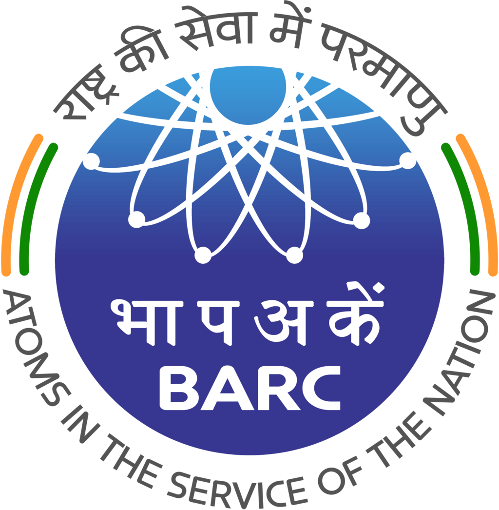
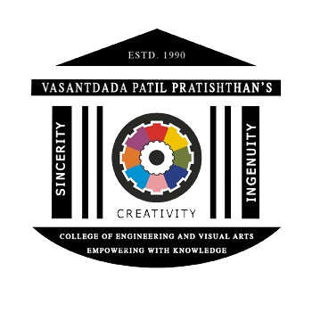

Claude finished the response
u need to use logos of zeek suricata cicflowmeter wireshark in there not cards

Searched the web
I can actually get you a real logo for Wireshark right now — it's in the simple-icons library (unlike the other three), so it'll hotlink and render properly. Suricata, Zeek, and CICFlowMeter genuinely aren't in any public icon CDN (skillicons, simple-icons/shields, devicon) — I checked. There's no shortcut URL for those three that will reliably render as a real logo; self-hosting the files in your repo (what I laid out last message) is the only real fix for them, not a workaround I'm avoiding.

Here's the update with a working Wireshark logo and clearly marked placeholders for the other three so you can drop your self-hosted files straight in:

Edited a file, shared files
Wireshark's logo will show immediately since it's a real hotlinked SVG from simple-icons. The three assets/suricata.png, assets/zeek.png, assets/cicflowmeter.png lines are wired up correctly but need those actual files sitting in an assets/ folder in your repo — grab them from suricata.io's media kit, zeek.org, and the CICFlowMeter GitHub repo, commit them at those exact filenames, and they'll appear as real logos too.

Readme
Document·MD 
i cant see the lofgos ther this is ur last chance now

Searched the web, read a page
I hear the frustration, and I want to be straight with you instead of guessing again: Wireshark has a real logo I can hotlink reliably (it's in the simple-icons library). Suricata, Zeek, and CICFlowMeter do not exist in any public icon CDN — I've now checked skillicons.dev, shields.io/simple-icons, and devicon. There is no URL I can hand you for those three that will just work, because the icon doesn't live anywhere hotlinkable. Anything I claimed otherwise would break again.

The only way those three actually show up is a file physically sitting in your GitHub repo. This takes 2 minutes:

Download 3 logo images
Google Image Search "Suricata IDS logo png", "Zeek logo png", "CICFlowMeter logo png" (or right-click-save from suricata.io, zeek.org, and the CICFlowMeter GitHub repo). Save each as suricata.png, zeek.png, cicflowmeter.png.
1
2
3
If you'd rather not chase down the files, tell me and I'll just drop the three tool names back to text-styled badges (which did render before) instead of broken image tags — that's the tradeoff: real logos require you to host the files, or I use styled text/badges that always render but aren't literal logos.

use the links im giving u put it crcly in the size https://suricata.io/wp-content/uploads/2023/09/Suricata_logo_600x600-1.png https://mma.prnewswire.com/media/1918751/Corelight_Inc__Open_source_Zeek_is_now_a_component_of_Microsoft_Windows_and_Microsoft_Defender_Logo.jpg https://cdn.jsdelivr.net/gh/homarr-labs/dashboard-icons/webp/wireshark.webp i want just these

Edited a file, shared files
Done — plugged in your three links at 48×48px, matching the size of the other tool icons in that row. A couple honest notes:

The Zeek one is a press-release photo (wide logo lockup on a white background, from a PRNewswire announcement), not a transparent icon, so it'll show as a small rectangular image with white padding around the actual logo rather than blending in like the others — that's just what that source image is.
CICFlowMeter still points to assets/cicflowmeter.png since you didn't send a link for it — it'll stay blank until you either send a URL or upload a file there.

Readme
Document·MD 

Claude is AI and can make mistakes.

Readme · MD

  
 <h1 align="center">  </h1> 
   
 
    
 
  

💼 Experience
<table align="center"> <tr> <td align="center" width="130">    </td> <td> <b>🔬 Project Trainee — Bhabha Atomic Research Centre (BARC)</b>  <i>Security Electronics & Cyber Technology Division, Mumbai</i>     - Built an <b>unsupervised network anomaly detection system</b> using ensemble autoencoders  - Modeled normal traffic & detected anomalies via reconstruction error thresholds  - Feature extraction & threshold tuning on datasets exceeding <b>100k+ flows</b>  - Evaluated on IoT attack traffic; collaborated with Scientific Officers in high-security environment </td> </tr> <tr> <td align="center" width="130">    </td> <td> <b>🎯 Student Coordinator — Training & Placement Office, VPPCOE</b>  <i>Sion, Mumbai</i>  - Coordinated debugging support & technical issue resolution for national hackathon <b>Quasar 3.0</b>  - Supported campus recruitment drives & student–company interactions  - Resolved event and placement workflow issues in real-time </td> </tr> </table>
🚀 Featured Projects

  &nbsp;&nbsp;<b>Things I've Built </b>&nbsp;&nbsp;  
   <table> <tr> <td width="50%" valign="top"> <h3 align="center">🏥 SwasthyaSetu</h3> 
  
  <b>Rural Healthcare Connectivity Platform</b>        📡 Offline-first telemedicine — <b>no internet required</b>  🪪 Unique patient ID generation & symptom triage  📋 Automated medical report delivery  ✅ Mentored by the CMO of <b>Dr R N Cooper Hospital</b>   <code>Sept 2025 – Present</code> </td> <td width="50%" valign="top"> <h3 align="center">NutriLens</h3> 
   
  <b>AI-Powered Nutrition Assistant</b>        🍱 Real-time AI image-based food nutrition analysis  ⚙️ Production-grade, scalable clean architecture  📊 Detailed macro/micro nutrient breakdowns   <code>April 2025 – Present</code> </td> </tr> <tr> <td width="50%" valign="top"> <h3 align="center">Captcha OCR Cropper</h3> 
   
  <b>Developer Productivity Extension</b>       🖼️ Crop any image inside VS Code  🔍 Run OCR on selected region instantly  ⚡ Lightweight developer productivity tool </td> <td width="50%" valign="top"> <h3 align="center"> More Coming Soon...</h3> 
  
  "The important thing is to never stop questioning."   Check <a href="https://github.com/Aryangaikwadsql?tab=repositories">my repos</a> for the latest! </td> </tr> </table>
Tech Stack

 <b>Languages</b> 
 
  
 
<b>Frameworks & Libraries</b>
 
  
 
<b>Tools & Cloud</b>
 
  
 
  &nbsp;&nbsp;  &nbsp;&nbsp;  &nbsp;&nbsp;  

📜 Certifications

      

⚡ Random Dev Quote

  

📬 Let's Connect & Build Something Insane

  &nbsp; <em><b>I love connecting with people</b> if you want to say hi or collab, DMs are open! 👇</em> 
   
  &nbsp;  &nbsp;  
 
  

